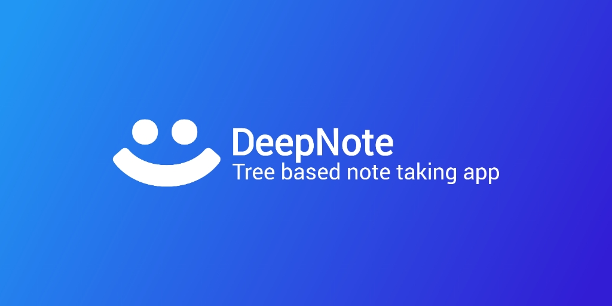

# DeepNote

An note taking app that allows you to create notes within other notes, like a tree.

## Platforms

DeepNote is specially made for android, and you can download its APK from [release section](https://github.com/Raffa064/DeepNote/releases). But you can also use it anywhere in your [favorite browser](https://raffa064.github.io/DeepNote).

**NOTE:** The android app works without internet, but you will need to be connect on first launch to download resources from this repo. (The app will altomatically update for new versions).

- [Go to Android app repo](https://github.com/Raffa065/DeepNote-App)

## About

I created this app with the purpose of facilitating the creation of todolists for my projects, which, depending on the complexity, have a structure similar to a tree. Therefore, DeepNote allows each note to contain a list of other notes, making the workflow more organized.

## Th'rd Party Libs

- [Sortable.js](https://sortablejs.github.io/Sortable/) ([repo](https://github.com/SortableJS/Sortable))
- [Quill.js](https://quilljs.com/) ([repo](https://github.com/quilljs/quill/))
